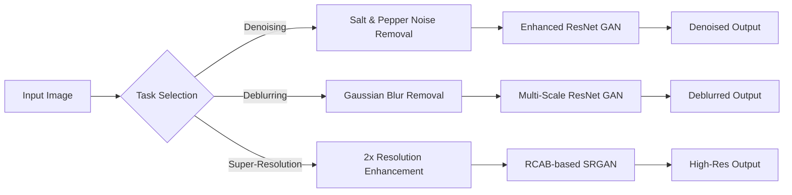

# 🖼️ CIFAR-10 Image Enhancement Toolkit

[](https://classroom.github.com/a/Ui7Z-_ux)

A comprehensive toolkit for enhancing images from the CIFAR-10 dataset with three powerful capabilities:

- 🧹 **Denoising** - Remove noise from corrupted images
- 🔍 **Deblurring** - Sharpen blurry images
- ⚡ **Super Resolution** - Increase image resolution with enhanced details

## 📋 Features

- Interactive GUI for easy visualization and comparison
- Pre-trained models optimized for CIFAR-10 images
- Individual inference scripts for testing each model separately
- Training scripts to reproduce or extend model training

## 🔄 Image Restoration Pipeline


## 🚀 Getting Started

### Prerequisites

1. Clone this repository
```bash
git clone https://github.com/yourusername/cifar10-image-enhancement.git
cd cifar10-image-enhancement
```

2. Create and activate a virtual environment
```bash
python3 -m venv venv
source venv/bin/activate  # On Windows: venv\Scripts\activate
```

3. Install required packages
```bash
pip install -r requirements.txt
```

4. Download pre-trained models
   - Create a `models` folder in the root directory
   - Download the pre-trained models from [this link](https://liveplymouthac-my.sharepoint.com/:f:/g/personal/pathirage_wijayarathna_postgrad_plymouth_ac_uk/Eq-PRdY3n_FHo5imC2ir7pUB2UZED49zVFWwJ0ImpOJ_GQ?e=WbEMfo)
   - Place the downloaded models in the `models` folder

## 🖥️ Usage

### Interactive GUI

Run the interactive GUI to enhance images with all available models:

```bash
python GUI.py
```

This will launch the toolkit interface where you can:
- Load CIFAR-10 images
- Apply different enhancement techniques
- Compare results side by side
- Save enhanced images

### Individual Model Testing

To test a specific enhancement model:

```bash
# For denoising
python denoise.py

# For deblurring
python deblur.py

# For super resolution
python super_resolution.py
```

## 🧠 Training Your Own Models

The `training_scripts` folder contains scripts to train each model type. To train a model:

```bash
# Example: Train denoising model
python training_scripts/train_denoise.py
```

## 📁 Project Structure

```
coursework-comp5013-tofuonmars/
├── initial_sourcecode/    #contains content from the original repo by timec21
│   ├── GAN,py   
│   ├── Hibrit.py
│   ├── Hybrit_Pytorch.pth  #The Pytorch version of Hibrit script create by us
    └── README.md    
├── models/                 # Pre-trained models directory
│   ├── best_generator_deblur.pth
│   ├── best_generator_denoised_3.pth
│   └── best_generator_sr_9.pth
└── training_scripts/       # Scripts to train models
    ├── training_denoise.py
    ├── training_deblur.py
    └── training_sr.py
├── GUI.py                  # Main interface of interactive GUI
├── inference_denoise.py    # Denoising inference script
├── inference_deblur.py     # Deblurring inference script
├── inference_sr.py         # Super resolution inference script
├── requirements.txt        # Package dependencies


```

## 📚 References

- [CIFAR-10 Dataset](https://www.cs.toronto.edu/~kriz/cifar.html)
- TThis project is built on top the work of https://github.com/timec21/image-restoration.git


## Contact

- [Puranjana Wijayarathna](https://github.com/puranjanaaa) : puranja@gmail.com
